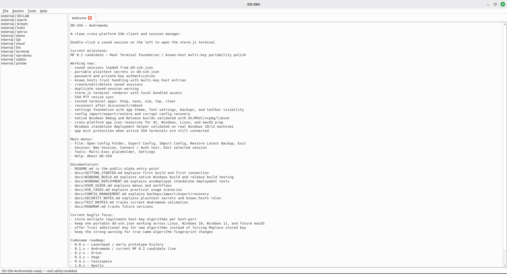
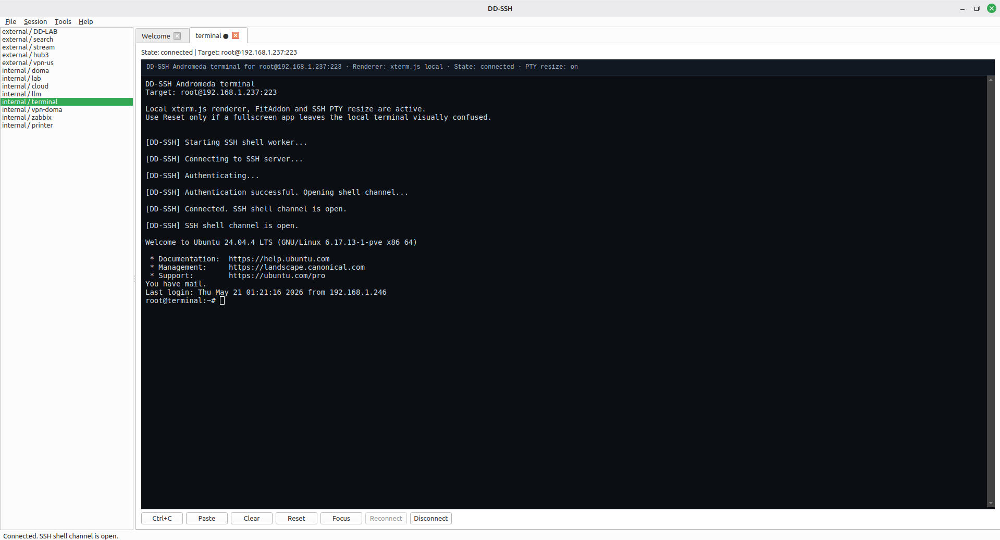
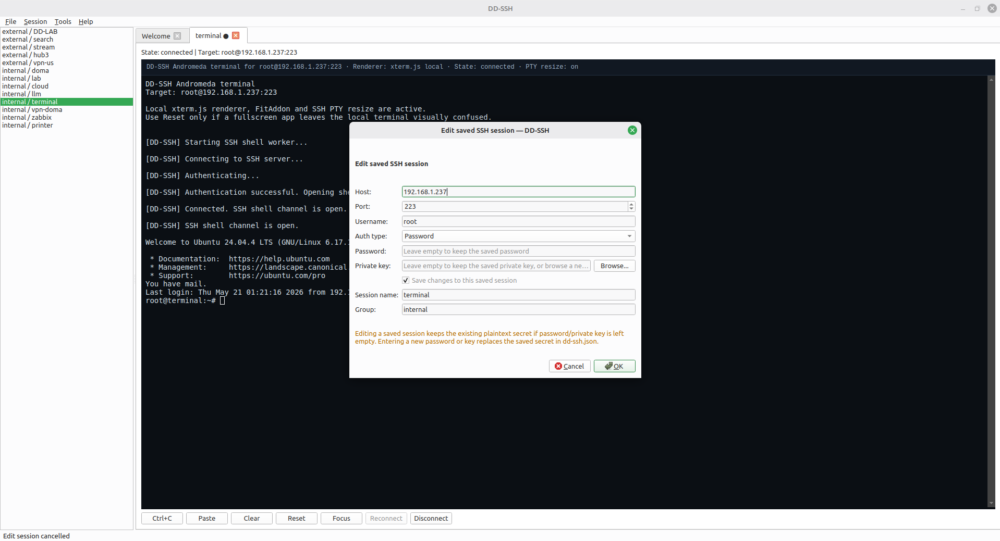
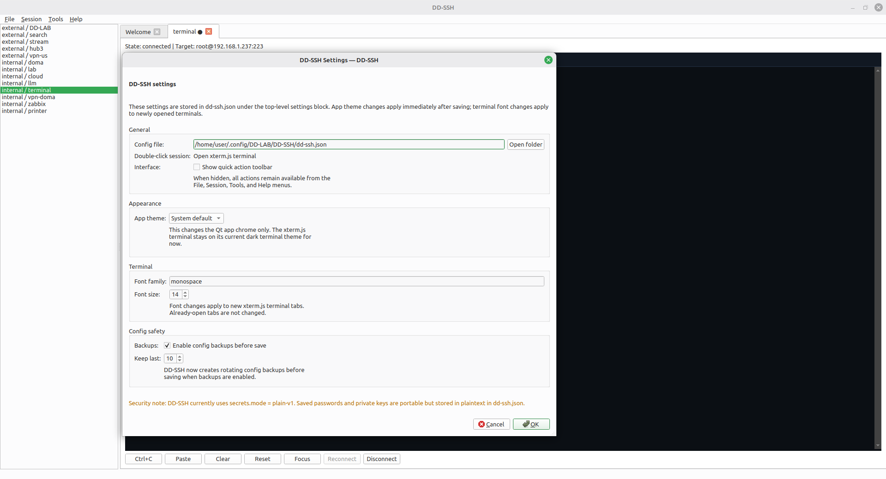
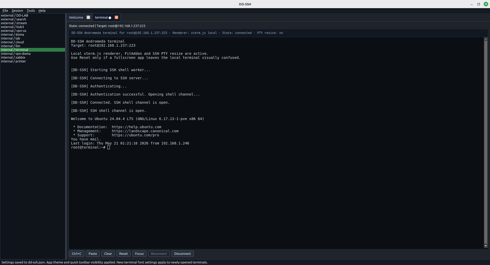
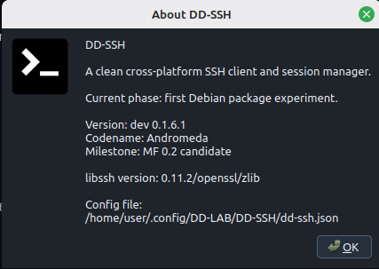

# DD-SSH Screenshots

**Checkpoint:** dev 0.1.6.4 — Andromeda
**Phase:** README screenshots and Debian packaging tutorial polish

This page contains the screenshot gallery used by the README. The screenshots were captured from the Linux `.deb` packaging validation pass and show the installed application running real saved sessions.

## 1. Welcome screen and saved sessions

The Welcome tab acts as a compact status page for the project. It shows the current Andromeda milestone, the active feature set, the menu layout, documentation pointers, bugfix focus, and the codename roadmap. The saved-session sidebar on the left shows grouped practical connection profiles loaded from `dd-ssh.json`.

## 2. Connected xterm.js SSH terminal

This is the main workflow: double-click a saved session and get a real shell. The terminal tab reports the connection target, xterm.js renderer status, PTY resize state, SSH worker lifecycle messages, authentication progress, and the final remote shell prompt.

## 3. Edit saved session dialog

The edit dialog supports practical saved-session maintenance. Existing password/private-key secrets can be kept by leaving the secret fields empty. Entering a new password or key replaces the saved secret in the portable JSON config.

## 4. Settings dialog

The Settings dialog exposes the active `dd-ssh.json` location, quick config-folder access, app theme selection, terminal font family and size for new tabs, quick-toolbar visibility, and rotating backup settings. The security note reminds users that early DD-SSH builds use plaintext portable secrets.

## 5. Dark theme terminal

DD-SSH supports a dark Qt application theme while the terminal remains in its dark xterm.js terminal style. This screenshot shows the normal connected terminal layout after changing the app theme.

## 6. About dialog

The About dialog is the fastest install sanity check. It shows the app name, current development version, codename, milestone, linked libssh backend version, and the exact config file path used by the installed build.
